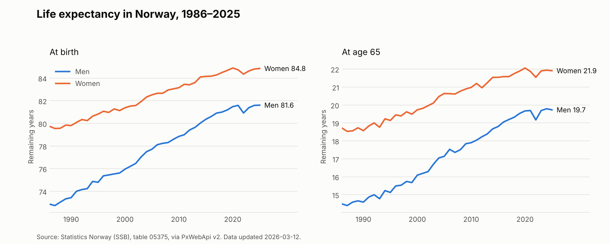

# Life expectancy in Norway from the SSB API

A small, reproducible Python pipeline that downloads official statistics from
Statistics Norway (SSB) through **PxWebApi v2**, cleans them, checks them, and
draws a figure.



**Result:** Between 1986 and 2025, life expectancy at birth rose from 72.9 to
81.6 years for men and from 79.7 to 84.8 years for women. The gap between
women and men at birth narrowed from 6.9 to 3.2 years. Both sexes show a dip
in 2022.

## What the pipeline does

1. **Fetch** – calls the SSB API for table
   [05375](https://www.ssb.no/en/statbank/table/05375) (remaining life
   expectancy by sex and age), selecting age 0 and 65, both sexes, all years.
   Retries on rate limiting (HTTP 429) and server errors, but not on bad
   requests.
2. **Save raw** – stores the untouched API response in `data/raw/` with the
   download date, so the analysis can be rerun later on exactly the same data.
3. **Parse** – converts the JSON-stat2 format into a tidy pandas DataFrame.
4. **Clean and check** – sets types, then stops with an error if anything is
   implausible (duplicates, unknown codes, values outside 0–110, or remaining
   life expectancy that does not fall with age).
5. **Output** – writes `data/processed/*.csv` and `figures/life_expectancy.png`.

## Run it

```bash
python -m venv .venv
source .venv/bin/activate        # Windows: .venv\Scripts\activate
pip install -r requirements.txt

python run.py            # download fresh data from SSB
python run.py --offline  # rerun on the newest saved raw file
pytest                   # run the tests
```

## Project layout

```
run.py                  entry point: fetch → clean → save → plot
src/ssb_life/api.py     API client and JSON-stat2 parser
src/ssb_life/clean.py   cleaning, plausibility checks, sex gap
src/ssb_life/plot.py    figure
tests/                  unit tests (no network needed; API calls are mocked)
data/raw/               raw API responses, one file per download
data/processed/         tidy CSV output
figures/                figure
```

## How the JSON-stat2 parsing works

SSB returns every number in one flat list. The order follows the dimensions in
`"id"` (here sex → age → contents → year), with the **last dimension changing
fastest**. The parser builds every combination of category codes in that order
with `itertools.product` and pairs each combination with its value. The tests
check this against known cells from the real response.

## Reproducibility

- Raw responses are kept and dated; `--offline` reruns everything without the network.
- Dependencies are pinned in `requirements.txt`.
- Tests run automatically on every push (GitHub Actions, `.github/workflows/tests.yml`).

## Data source

Statistics Norway, table 05375, accessed through
[PxWebApi v2](https://www.ssb.no/en/api/pxwebapiv2). SSB statistics are openly
licensed (CC BY 4.0).
